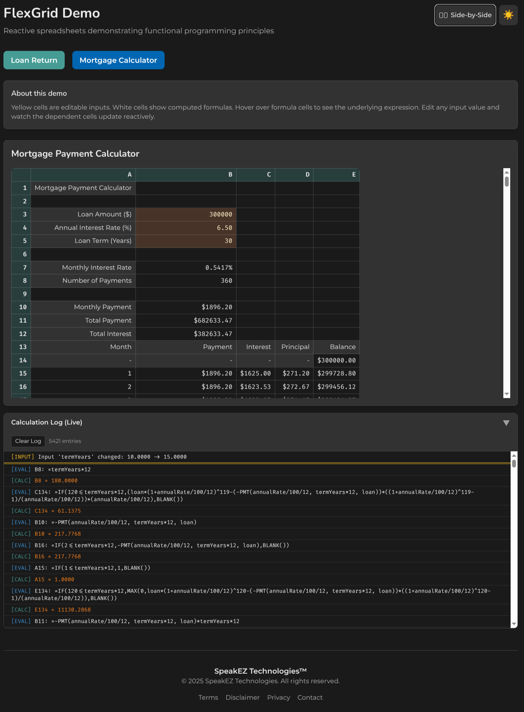

# FlexGrid

**A Demonstration of Reactive Functional Programming in Spreadsheets**

<!-- TODO: Add presentation video link when available -->



## The Truth Hiding in Plain Sight

Over 1.5 billion people use spreadsheets daily. Every one of them is leveraging functional programming. They just don't use or even consider programming jargon.

When a finance professional writes `=B1*(1+B2/100)^B3` to calculate compound interest, they've created a pure function: same inputs produce same outputs, no side effects, automatic dependency tracking. This is referential transparency. This is declarative programming. This is what functional programmers have advocated for decades.

FlexGrid shows how this connection is concrete. It renders reactive spreadsheets in the browser using F# and SolidJS, showing that the F# function:

```fsharp
let futureValue principal rate years =
    principal * (1.0 + rate / 100.0) ** float years
```

...and the spreadsheet formula:

```
=principal*(1+rate/100)^years
```

...are the same computation with different notation.

## Why This Matters

Spreadsheets succeed *because* of functional language design. 

> Simon Peyton-Jones, inventor of the Haskell functional programming language, also helped create the "Calc.ts" library for Excel Online. When he refers to Excel as 'functional programming for the masses' he's not speaking idly.

The properties that make spreadsheet models trustworthy: predictable results, auditable calculation chains, no hidden state are precisely the properties that functional programming provides.

When advocating for functional programming in your organization, you're not asking leadership to trust something foreign. You're asking them to recognize that the principles they already trust in their spreadsheets apply equally to the systems that run their business.

## How It Works

FlexGrid demonstrates the functional nature of spreadsheet computation through several mechanisms:

### Formula Parser

The [FormulaParser](src/FlexGrid/FormulaParser.fs) implements a recursive descent parser for Excel-style formulas. It handles:

- Cell references (`A1`, `B2`, `AA10`)
- Named references (`principal`, `rate`, `years`)
- Arithmetic with proper precedence (`+`, `-`, `*`, `/`, `^`)
- Comparison operators (`<`, `>`, `<=`, `>=`, `<>`)
- Function calls (`SUM`, `AVERAGE`, `IF`, `PMT`, etc.)

The parser produces an AST that explicitly represents the formula's structure—the same structure that spreadsheet engines use internally.

### Reactive Engine

The [ReactiveEngine](src/FlexGrid/ReactiveEngine.fs) compiles formula ASTs into signal-based computations. Each formula becomes a function that:

1. Reads values from dependent signals
2. Computes the result
3. Automatically re-executes when dependencies change

This is functional reactive programming—the same model that powers every spreadsheet's recalculation engine. When cell A1 changes, only cells that depend on A1 recompute. The dependency graph determines evaluation order automatically.

### Calculation Logging

The [CalcLog](src/FlexGrid/CalcLog.fs) module provides tracing of the reactive evaluation cascade. When enabled, it logs:

- Input value changes
- Formula evaluation start/completion
- The propagation of changes through dependent cells

This makes the "spreadsheets are functional programming" insight visible—you can watch the pure function evaluation cascade in real-time.

### Signal Registry

Input cells create signals (reactive state containers). Formula cells create derived computations that read from those signals. The registry tracks:

- Cell signals by position (`(col, row) -> Accessor<float>`)
- Named signals by identifier (`string -> Accessor<float>`)
- Setters for input cells

This mirrors how spreadsheet engines maintain their internal state—a graph of values and the formulas that connect them.

### Partas.Solid Components

The [FlexGrid.Solid](src/FlexGrid.Solid/) library provides UI components that render the reactive model:

- **InputCell**: Editable cells bound to signals. Type a new value, and dependent cells update instantly.
- **FormulaCell**: Read-only cells displaying computed values. Hover to see the underlying formula.
- **SpreadsheetGrid**: The table structure with optional Excel-style headers (A, B, C... and 1, 2, 3...).
- **LiveLogPanel**: Accordion panel showing the reactive calculation cascade in real-time.

SolidJS's fine-grained reactivity means only the specific DOM nodes for changed cells update—no virtual DOM diffing, no unnecessary re-renders. This is the same optimization strategy that spreadsheet engines use.

## Project Structure

```
FlexGrid/
├── src/
│   ├── FlexGrid/                 # Core library (no UI dependencies)
│   │   ├── Model.fs              # ReactiveCell, ReactiveModel types
│   │   ├── FormulaParser.fs      # Excel formula parser
│   │   ├── CalcLog.fs            # Calculation tracing/logging
│   │   ├── ReactiveEngine.fs     # Signal-based computation
│   │   └── Builder.fs            # DSL for constructing spreadsheets
│   │
│   └── FlexGrid.Solid/           # Browser UI components
│       ├── Styles.fs             # Tailwind CSS class definitions
│       ├── Components.fs         # InputCell, FormulaCell, etc.
│       ├── Grid.fs               # SpreadsheetGrid component
│       ├── LogPanel.fs           # Live calculation log accordion
│       └── Render.fs             # Model-to-component transformation
│
├── demos/                        # Example applications
│   ├── CompoundInterest.fs       # Future value calculator
│   ├── MortgageCalculator.fs     # Loan payment calculator
│   └── App.fs                    # Demo application entry point
│
├── build/                        # FAKE build system
│   ├── Build.fsproj              # Build project
│   └── Build.fs                  # Build targets and tasks
│
└── tests/                        # Unit tests
    ├── FormulaParserTests.fs     # Parser correctness
    └── ReactiveEngineTests.fs    # Evaluation correctness
```

## Getting Started

### Prerequisites

- [.NET 10 SDK](https://dotnet.microsoft.com/download) (10.0.100 or later)
- [Node.js](https://nodejs.org/) (v18+)

Fable 5 is installed as a local tool and will be restored automatically.

### Installation

```bash
# Clone the repository
git clone https://github.com/yourusername/FlexGrid.git
cd FlexGrid

# Restore .NET tools (Fable 5)
dotnet tool restore

# Restore .NET packages
dotnet restore

# Install npm dependencies
npm install
```

### Development

The project uses a FAKE-based build system that can be run with `dotnet run`:

```bash
# Start development server (compiles F# to JS and serves with hot reload)
dotnet run --project build

# Or use npm scripts directly:
npm run dev
```

Available build targets (pass as argument to `dotnet run --project build`):

| Target | Description |
|--------|-------------|
| `Dev` | **(default)** Compile and start Vite dev server |
| `Watch` | Run Fable watch and Vite concurrently for hot reload |
| `Compile` | Compile F# to JavaScript only |
| `Build` | Production build (compile + Vite build) |
| `Test` | Run unit tests |
| `Preview` | Preview production build |
| `Clean` | Clean output directories |
| `All` | Run all targets (build + test) |

```bash
# Examples:
dotnet run --project build -- Test     # Run tests
dotnet run --project build -- Build    # Production build
dotnet run --project build -- Watch    # Development with hot reload
```

### Building for Production

```bash
# Build optimized output
dotnet run --project build -- Build

# Preview production build
dotnet run --project build -- Preview
```

## Defining Spreadsheets

FlexGrid provides a builder DSL for defining reactive spreadsheets:

```fsharp
open FlexGrid

let model =
    let builder = reactiveSheet()

    builder.Label("Principal")
    builder.Input("principal", 10000.0, format = "N0")
    builder.NewRow()

    builder.Label("Rate (%)")
    builder.Input("rate", 7.0, format = "N2")
    builder.NewRow()

    builder.Label("Years")
    builder.Input("years", 10.0, format = "N0")
    builder.NewRow()

    builder.Label("Future Value")
    builder.Formula("=principal*(1+rate/100)^years", format = "C2")

    builder.Build()
```

The formula syntax matches Excel. Named references (`principal`, `rate`, `years`) bind to input cells. Change any input, and the formula recalculates automatically.

## Supported Functions

The formula engine supports common spreadsheet functions:

| Category | Functions |
|----------|-----------|
| Aggregation | `SUM`, `AVERAGE`, `MAX`, `MIN` |
| Math | `ABS`, `SQRT`, `ROUND`, `FLOOR`, `CEILING`, `POWER`, `LOG`, `LN`, `EXP` |
| Logic | `IF` |
| Financial | `PMT`, `FV`, `PV` |

Additional functions can be added to [ReactiveEngine.fs](src/FlexGrid/ReactiveEngine.fs).

## Dependencies

- **[Partas.Solid](https://github.com/shayanhabibi/Partas.Solid)** (2.1.3) - F# bindings for SolidJS
- **[Fable](https://fable.io/)** (5.0.0-alpha.14) - F# to JavaScript compiler
- **[SolidJS](https://www.solidjs.com/)** (1.9.x) - Fine-grained reactive UI library
- **[Vite](https://vitejs.dev/)** (5.x) - Build tooling
- **[Tailwind CSS](https://tailwindcss.com/)** (3.x) - Styling

> **Note**: Fable 5.0.0-alpha.14 is required for compatibility with Partas.Solid.FablePlugin 2.1.3. Later Fable 5 alpha versions may have breaking changes with the plugin.

## Contributing

Contributions are welcome! See [CONTRIBUTING.md](CONTRIBUTING.md) for guidelines.

Areas where contributions would be particularly valuable:

- Additional spreadsheet functions (especially financial and statistical)
- Range reference support (`A1:A10`)
- Conditional formatting
- Chart integration
- Additional demo spreadsheets
- Documentation improvements

## License

This project is licensed under the MIT License. See [LICENSE](LICENSE) for details.

## Acknowledgments

- **Simon Peyton Jones** for the insight that "Excel is the world's most widely used functional programming language"
- **Shayan Habibi** for [Partas.Solid](https://github.com/shayanhabibi/Partas.Solid)
- The 1.5+ billion spreadsheet users who prove daily that functional programming dominates business return-of-value
